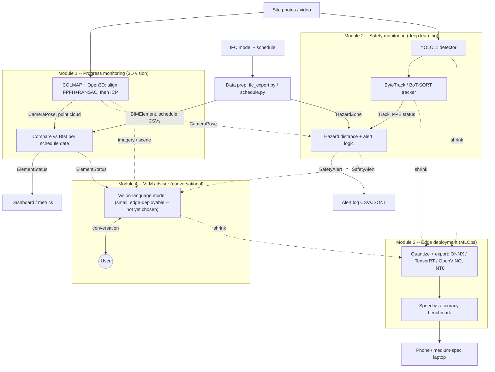

# 4D BIM-Aligned Digital Twin & Automated Progress Monitor

Project overview for a two-person team. A computer vision pipeline that tracks construction progress and site safety automatically.

## 1. What We Are Building

Construction progress and safety are checked by hand, which is slow, subjective and misses issues between inspections. We build a pipeline that takes site images or video and compares what has actually been built (as-built) with the building design and schedule (as-planned, the BIM).

The system answers three questions automatically:

- **What is built, and what is delayed?** Per-element status against the schedule.
- **How much material is in place?** Volume estimates.
- **Is anyone in danger?** Workers without proper PPE near hazards, with real distances.

## 2. The Modules

| Module | What it does | Main tools |
|---|---|---|
| 1. Progress monitoring (3D vision) | Rebuilds the site in 3D from photos, aligns it to the BIM, and compares with the schedule. Outputs per-element status, delay flags and material volume. | COLMAP, Open3D, registration + ICP |
| 2. Safety monitoring (deep learning) | Detects and tracks workers, checks PPE, and measures real distance to hazards from a single camera. Outputs a safety alert log. | YOLO11, ByteTrack / BoT-SORT, Depth Anything V2 |
| 3. Edge deployment (MLOps) | Shrinks the models so they run on a low-power device. Outputs a speed vs accuracy benchmark. | ONNX, TensorRT / OpenVINO, INT8 |
| 4. VLM advisor (conversational) | Looks directly at site imagery/the reconstructed scene plus the structured status from modules 1-2, narrates what's done/missing/wrong/needed, and discusses it with the user. Must run on phone-class and medium-spec laptop hardware, so it shares Module 3's quantization/export path. See [VLM_ADVISOR.md](VLM_ADVISOR.md) for open design questions. | VLM (small/edge-deployable, not yet chosen), same edge pipeline as Module 3 |

The 3D alignment tells us where the camera is in the building's coordinates, so safety distances are measured against real hazard zones from the BIM. Modules 1 and 2 are two halves of one system.

### System Diagram

A static PNG/PDF of this same diagram (for sharing outside GitHub) is at
[diagrams/pipeline-architecture.png](diagrams/pipeline-architecture.png) /
[diagrams/pipeline-architecture.pdf](diagrams/pipeline-architecture.pdf).

## 3. Data Strategy

We use real public data wherever it exists, and synthetic data only where it does not.

- **Worker and PPE detection:** public construction and PPE datasets (check licences). Plenty exist.
- **Site images linked to a BIM and schedule over several dates:** Blender, using one small synthetic building. No public dataset has images, a BIM, a schedule and exact ground truth together.
- **Exact depth, distance to hazards and near-miss clips:** Blender. Near-misses are rare in real data, and we need true 3D positions to validate our distances.
- **Real-world check:** a small phone or drone capture, to show the pipeline works beyond simulation.

The Blender scope is deliberately small: about 10 building elements, 5 to 8 dates, roughly 2 weeks of work.

## 4. Tech Stack

- **3D:** COLMAP, Open3D (FPFH + RANSAC, then robust ICP), IFC format with IfcOpenShell
- **Synthetic data:** Blender
- **Deep learning:** PyTorch, YOLO11, ByteTrack, BoT-SORT, Depth Anything V2 (metric)
- **Edge:** ONNX, TensorRT / OpenVINO
- **Engineering:** Python, conda, Git and GitHub, DVC, Weights & Biases, GitHub Actions

Design decisions already made: COLMAP is the main reconstruction method (NeRF is an optional extra). Alignment is global first, then ICP, against the part of the BIM that should exist by the capture date.

## 5. Environment and Docker Plan

We will not use Docker for day-to-day development. It takes a lot of disk space, and nothing in the project needs it until the final release. The Dockerized repository is a polish item.

1. Each of us works in a conda environment with a pinned `environment.yml` (or a venv with `requirements.txt`). It is light and fast, and enough for reproducibility.
2. Install COLMAP through conda or its pip package. Check that the build has CUDA support, since dense reconstruction needs it.
3. Write the Dockerfile in the repository anyway, since a file costs nothing. Never build it locally unless needed.
4. Have GitHub Actions build it around week 12 to prove it works, so no laptop pays the storage cost. If we want a real run, only the GPU PC builds it, once.

## 6. Phases (14 Weeks)

| Weeks | Phase | Outcome |
|---|---|---|
| 1 | Setup | Git repository, conda environments, shared coordinate conventions |
| 2-3 | Data | Blender site, IFC and schedule, rendered images; PPE datasets prepared |
| 4-7 | Core modules (in parallel) | 3D reconstruction and BIM alignment; detector, tracker and depth |
| 8-9 | Analytics and safety logic | Progress and delay flags, volumes, hazard alerts, with metrics |
| 10-11 | Edge optimization | Quantized models, FP32 / FP16 / INT8 benchmarks |
| 12 | Integration | One command runs the full pipeline; dashboard; Dockerfile verified by GitHub Actions |
| 13-14 | Writing and release | Paper-style README, demo video, public repository |

Weeks 4 to 7 usually overrun, so weeks 13 and 14 are protected for writing. If we fall behind, we cut stretch goals first.

## 7. Success Targets and Deliverables

Starting targets on synthetic data (adjust after the first baseline):

- Alignment to BIM: error under 5 cm and under 1 degree
- Progress status: F1 above 0.85
- Volume estimate: error under 10%
- PPE detection: mAP50 above 0.80
- Tracking: compare two trackers (HOTA, ID switches)
- Distance to hazard: error reported by range
- Edge: at least 15 FPS on the target device, with the INT8 accuracy drop reported honestly

Final deliverables: an open-source repository with a one-command pipeline and a Dockerfile checked by GitHub Actions, a before/after edge benchmark chart, a demo video, and a README written like a short research paper.
